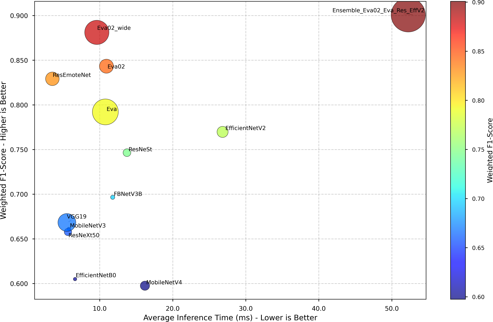

# FER_Pipeline

## Overview
FER_Pipeline is a facial expression recognition system that processes images or videos to detect and classify human emotions using advanced machine learning techniques. The project includes tools for image preprocessing, feature extraction, model training, inference, and results visualization.

## Features
- **Model Training:** Tools to train and evaluate various machine learning models.
- **Inference:** Real-time and batch predictions on input data.
- **Visualization:** Graphical display of prediction results and performance metrics.

## Pipeline preview


## Requirements
- Python 3.9+
- Dependencies listed in `requirements.txt`

## Installation
1. **Clone the repository:**
   ```bash
   git clone https://github.com/username/FER_Pipeline.git
   ```
2. **Install the required packages:**
   ```bash
   pip install -r requirements.txt
   ```
3. **Navigate into the project directory:**
   ```bash
   cd Detection_pipeline
   ```
4. **Read the ``usage.md`` then run ``pipeline.py`` accordingly.**

## Project Structure

- **Datasets**: Contains the externally downloaded datasets used in this project due to their large size.
- **Detection_Pipeline**: Have the core pipeline for face detection, the ensemble model module, and the ResEmoteNet architecture. It also includes an experimental pipeline and separate components for dedicated testing.
- **Evaluation**: Contains scripts for evaluating individual models as well as the ensemble performance.
- **Models**: Includes code for model training and a directory for storing model checkpoints.
- **Results**: Stores sample outputs including detection results on test images, evaluation graphs, CSV files of metrics, and examples of the pipeline applied to images.

## Benchmark results



## License
Specify your project license here or refer to the [LICENSE](LICENSE) file.